<!-- Add links to top -->

Setup Guide <!-- omit in toc -->
===============================================

(C) Tim Curtis 2024  
(C) @azimuth 2024 Pi Imager tutorial  

### Table of Contents <!-- omit in toc -->

- [1. Introduction](#1-introduction)
- [2. Creating a boot SD Card](#2-creating-a-boot-sd-card)
- [3. After Startup](#3-after-startup)
  - [3.1. Audio Devices](#31-audio-devices)
  - [3.2. Music Files](#32-music-files)
  - [3.3. Hotspot](#33-hotspot)
  - [3.4. File Sharing](#34-file-sharing)
  - [3.5. Software Updates](#35-software-updates)
- [4. Imager Tutorial](#4-imager-tutorial)
- [5. Advanced](#5-advanced)
  - [5.1. REST API](#51-rest-api)
  - [5.2. SSH Commands](#52-ssh-commands)

# 1. Introduction

Moode audio player is a Free Open Source Software (FOSS) music streamer for the wonderful Raspberry Pi family of Single Board Computers (SBC). To access the player enter `http://moode, moode.local or ip_address` in a Web Browser. If you are using a Smartphone use the "Save to Home Screen" option on IOS or Android to create a moOde App.

[Quick help](https://github.com/moode-player/docs/blob/main/Quickhelp.pdf)  contains instructions for navigating Moode and using its features including Multiroom audio. Quick help is located on the `m` menu in the player.

# 2. Creating a boot SD Card

Before you can access Moode a pre-built image must be configured and written to a micro SD Card using the official Raspberry Pi Imager [Imager]. Download links for the Imager and Moode pre-built images are available on the Downloads page at [moodeaudio.org](https://moodeaudio.org) Pre-built images can also be conveniently selected directly in the `Media Player OS` section of the Imager.

Refer to the included [Tutorial](#4-imager-tutorial) for step by step instructions.

Note: For improved security, pre-built images do not contain a default logon userid, WiFi SSID or Hotspot password, and Secure Shell (SSH) access is disabled by default. These are configured using the Imager.

# 3. After Startup

After Moode starts up and you access it in your Web Browser you can configure your audio device, add music files to create your Library, connect an HDMI display and make use of all the advanced, Audiophile-grade features to create a great listening experience.

[Back to Top](#setup-guide-)

## 3.1. Audio Devices

#### USB audio device
- Plug in the device
- Menu > Configure > Audio
- Set `Output device` to the name of the USB audio device

#### I2S audio device
- Power down the Pi and attach the device to the 40-pin header
- Power up the Pi
- Menu > Configure > Audio
- Set `Named I2S device or DT overlay` to the correct device or overlay name
- Restart the Pi
- Menu > Configure > Audio
- Set `Output device` to the name of the I2S audio device

#### Audio device options

There are many other audio device options available for example `Volume type`, `Chip options`, and `ALSA output mode` just to name a few. For more information on a given option read the help text underneath it or the expandable info help next to it.

## 3.2. Music Files

#### USB storage device
- Plug in the device
- Menu > Update library
- Stay on the screen and wait for the activity spinner to be cleared

#### Boot SD Card storage
- Place your music files under the directory `/mnt/SDCARD`
- Menu > Update library
- Stay on the screen and wait for the activity spinner to be cleared

#### Network Attached Storage (NAS) Device
- Menu > Configure > Library
- Click `CREATE music source`
- Enter the Type, Path and credentials that provides access to your NAS
- Click `SAVE`
- A green checkmark will appear if the NAS was successfully mounted
- Click the Arrow or Home icon in the upper left of the screen to return to Playback view
- Menu > Update library
- Stay on the screen and wait for the activity spinner to be cleared

## 3.3. Hotspot

Moode provides a WiFi Hotspot on the 2.4 GHz WiFi band. Refer to the
default settings below.

|Setting|Value|
|:-|:-|
|SSID|Moode|
|Password|As set in the Network Config screen|
|URL|`http://moode.local or http://172.24.1.1`|

The Hotspot starts when one of the following are true.

- WiFi SSID is set to "Activate Hotspot" in Network Config.
- WiFi SSID is configured in Network Config but no IP address was assigned after attempting to connect to the configured SSID or any saved SSID's.

## 3.4. File Sharing

Moode can be used as a File Server by turning on one or more of the file sharing protocols listed below. These protocols and their respective options are in the File Sharing section of System Config.

- SMB File Sharing. SMB (Samba) shares named NAS, Playlists, and SDCard are automatically created. Each USB disk will also have a Samba share created that is named after its Disk Label.

- NFS File Sharing. Access and option defaults are provided but can be manually overridden. Each USB disk will have an NFS export created whose path is /media/Disk Label.

- DLNA File Sharing. The DLNA media server indexes music sources defined for MPD and makes them available to a UPnP control point.

## 3.5. In-Place Software Updates

Updates to Moode are available via `CHECK for software update` in System Config. The updates are keyed to a major release series for example Moode 9. There are no in-place updates across major releases for example Moode 8 to Moode 9. Each new major release requires a fresh image.

[Back to Top](#setup-guide-)

# 4. Imager Tutorial

Moode requires using the official Raspberry Pi Imager to configure the OS image before writing it to an SD Card. Follow these step by step instructions to carry out this process.

1. [Download](https://www.raspberrypi.com/software/) the official Raspberry Pi Imager.

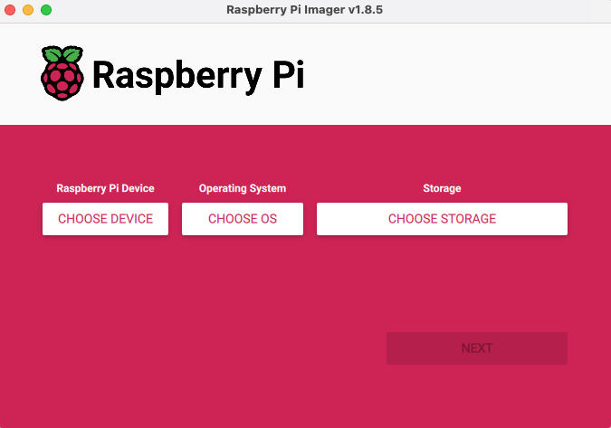

2. Click CHOOSE OS and scroll down to `Media Player OS` and then to `moOde audio player` and then click the version of moOde you would like to install.

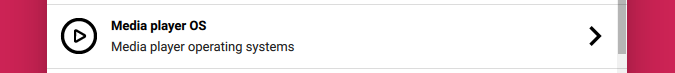

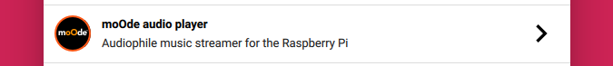

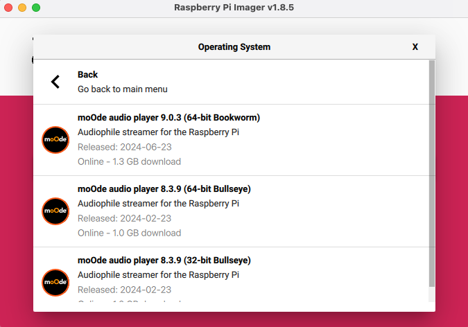

  Or if you have downloaded moOde directly from the Download page at [moodeaudio.org](https://moodeaudio.org), then scroll down to `Use custom` and select the downloaded zip file from the file chooser.

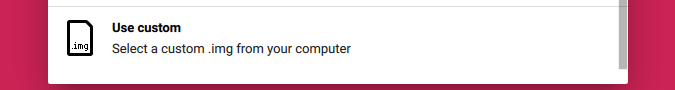

3. After the OS is selected click `CHOOSE STORAGE` then click the SD card drive where the OS image will be written.

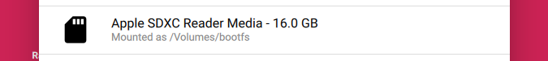

4. Click `NEXT` to display the `OS customization` screen

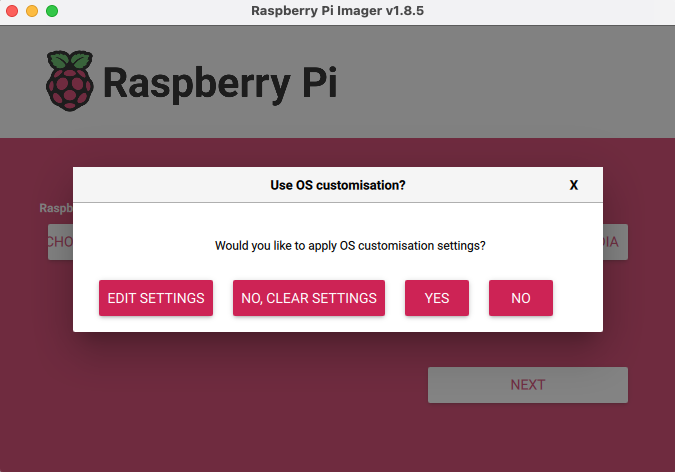

5. Click `EDIT SETTINGS` to display the `OS customization` screen. On the `GENERAL` tab enter your desired hostname, userid and password, optional WiFi SSID and password and finally the Locale.

6. Click the `SERVICES` tab and enable SSH with password authentication.

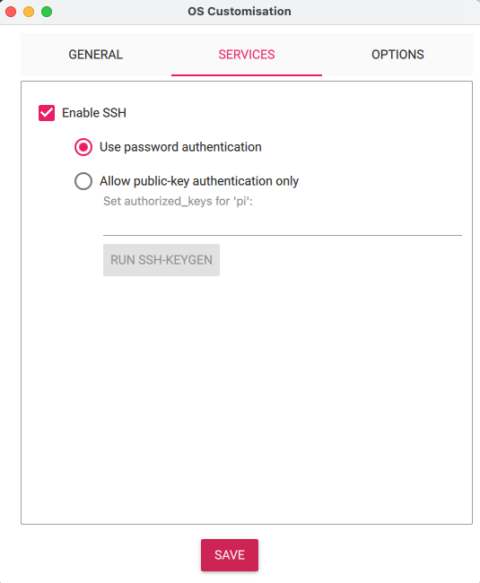

7. Click SAVE which will return you to the `OS Customization` screen.

8. Click `YES` to apply the customizations and display the confirmation screen.

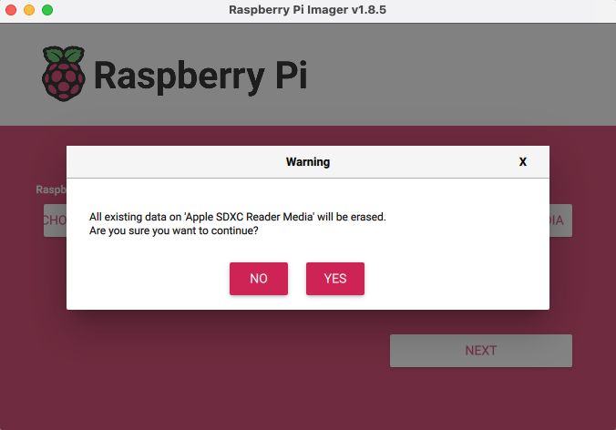

9. Click `YES` to proceed and write the OS image to the SD Card and automatically verify it after the write completes.

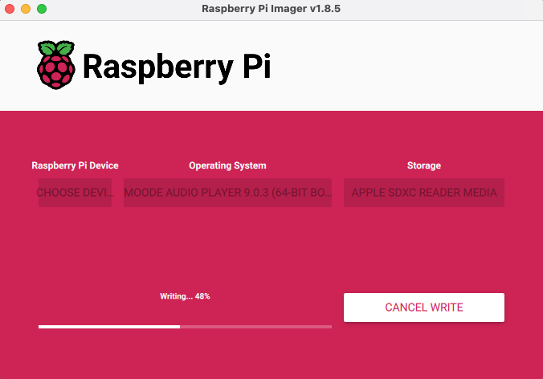

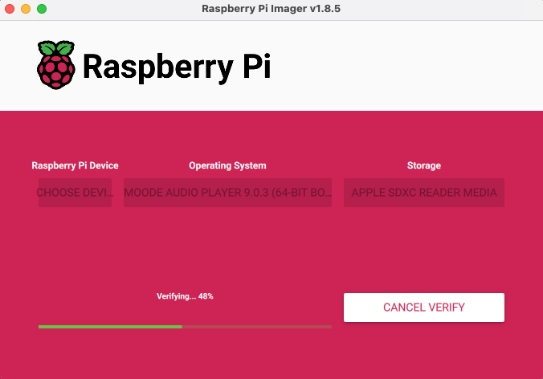

10. After verification is complete the SD Card can be removed from the drive and inserted into a Raspberry Pi for initial startup.

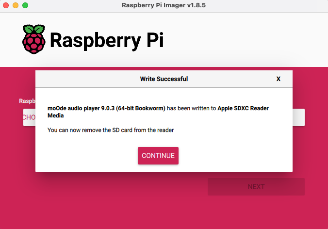

[Back to Top](#setup-guide-)

# 5. Advanced

## 5.1. REST API

The base URL for submitting commands to Moode is `http://moode/command/?cmd=` If a command returns data it is in JSON format following REST guidelines.

#### get_currentsong
Returns contents of the file /var/local/www/currentsong.txt.
Turn on the Metadata file option in Audio Config to generate this file.

#### get_output_format
ALSA output format or 'Not playing' is returned.

#### get_volume
Returns the Knob volume.

#### set_volume
Sets the knob volume to value N, up or down N or mute toggle.  
Arguments: `N | -up N | -dn N | -mute`

#### get_cdsp_config
Returns the current CamillaDSP config name

#### set_cdsp_config
Sets CamillaDSP to the specified config name.  
Arguments: A config name from the list of available configs including 'Off'.

#### set_coverview
Turns CoverView screen saver on or off.  
Arguments: `-on | -off`

#### upd_library
Submits an "Update library" command.

#### restart_renderer
Restarts the specified renderer.  
Arguments: `--bluetooth | --airplay | --spotify | --squeezelite | --plexamp | --roonbridge`

#### MPD commands
See [MPD protocol](https://mpd.readthedocs.io/en/latest/protocol.html) for list of commands.

#### Deprecated REST API commands.
In Moode 9 series the following commands have been replaced by the equivalent new commands above and at some point will not be supported. It is recommended to update your scripts to use the new commands.

- vol.sh
- coverview.php
- libupd-submit.php
- restart-renderer.php

## 5.2. SSH Commands

There are several useful commands that can be run at the prompt in an SSH terminal.

#### moodeutl
This command can be used for printing logs, status or for manipulating certain
parts of Moode.  
`moodeutl --help`.

#### mpc
This command can be used to control MPD.  
`mpc help`.

#### vol.sh
This command can be used to get or set MPD volume and update the Volume Knob.  
`/var/www/util/vol.sh --help`.

#### libupd-submit.php
This command performs the equivalent of Menu > Library update.  
`/var/www/util/libupd-submit.php`

#### coverview.php
This command turns the CoverView screen saver on or off.  
`/var/www/util/coverview.php -on | -off`

#### restart-renderer.php
This command restarts the specified renderer.  
`/var/www/util/restart-renderer.php --help`  

[Back to Top](#setup-guide-)
