<!-- Add links to top -->

Setup Guide <!-- omit in toc -->
===============================================

## m<span style="color:#DD6900">oO</span>de audio player 10 series
(C) Tim Curtis 2024  
(C) @azimuth 2024 Pi Imager 1.x tutorial

### Table of Contents <!-- omit in toc -->

- [1. Introduction](#1-introduction)
- [2. Creating the boot media](#2-creating-the-boot-media)
- [3. Starting up the system](#3-starting-up-the-system)
- [4. After Startup](#4-after-startup)
  - [4.1. Audio Devices](#41-audio-devices)
  - [4.2. Music Files](#42-music-files)
  - [4.3. Hotspot](#43-hotspot)
  - [4.4. File Sharing](#44-file-sharing)
  - [4.5. Software Updates](#45-software-updates)
- [5. Pi Imager Tutorial](#5-pi-imager-tutorial)
- [6. Advanced](#6-advanced)
  - [6.1. REST API](#61-rest-api)
  - [6.2. SSH Commands](#62-ssh-commands)

# 1. Introduction

Moode audio player is a Free Open Source Software (FOSS) music streamer for the wonderful Raspberry Pi family of Single Board Computers (SBC). To access the player enter `http://moode, moode.local or ip_address` in a Web Browser. If you are using a Smartphone use the "Save to Home Screen" option on IOS or Android to create a moOde App.

[Quick help](https://github.com/moode-player/docs/blob/main/Quickhelp.pdf)  contains instructions for navigating Moode and using its features including Multiroom audio. Quick help is located on the Main Menu which is accessed via the `m` in the upper right of the WebUI.

# 2. Creating the boot media

Use the [Raspberry Pi Imager](https://www.raspberrypi.com/software/) to download a Moode release image from the `Media Player OS` section, configure it with required login userid/password and SSH terminal access, and optional WiFi SSID/password, then write the image to the boot media. Types of boot media include micro SDcard, USB drive and NVMe drive.

__IMPORTANT!__ The image must be configured with a login userid/password and SSH enabled or Moode will not function correctly. Refer to the [Pi Imager Tutorial](#5-pi-imager-tutorial) section for step by step instructions.

# 3. Starting up the system

The first startup will take a while. The system automatically reboots 3 times after initially starting to import and apply the settings from the Pi Imager and complete Moode startup configuration.

# 4. After Startup

After Moode starts up and you access it in your Web Browser you can configure your audio device, add music files to create your Library, connect an HDMI display and make use of all the advanced, Audiophile-grade features to create a great listening experience.

[Back to Top](#setup-guide-)

## 4.1. Audio Devices

#### USB audio device
- Plug in the device
- Menu > Configure > Audio
- Set `Output device` to the name of the USB audio device

#### I2S audio device
- Power down the Pi and attach the device to the 40-pin header
- Power up the Pi
- Menu > Configure > Audio
- Set `Named I2S device or DT overlay` to the correct device or overlay name
- Restart the Pi
- Menu > Configure > Audio
- Set `Output device` to the name of the I2S audio device

#### Audio device options

There are many other audio device options available for example `Volume type`, `Chip options`, and `ALSA output mode` just to name a few. For more information on a given option read the help text underneath it or the expandable info help next to it.

## 4.2. Music Files

#### USB storage device
- Plug in the device
- Menu > Update library
- Stay on the screen and wait for the activity spinner to be cleared

#### NVMe and SATA Storage
- Place your music files under the directory `/mnt/NVME or /mnt/SATA`
- Menu > Update library
- Stay on the screen and wait for the activity spinner to be cleared

#### Boot media storage
- Place your music files under the directory `/mnt/OSDISK`
- Menu > Update library
- Stay on the screen and wait for the activity spinner to be cleared

#### Network Attached Storage (NAS) Device
- Menu > Configure > Library
- Click `CREATE music source`
- Enter the Type, Path and credentials that provides access to your NAS
- Click `SAVE`
- A green checkmark will appear if the NAS was successfully mounted
- Click the Arrow or Home icon in the upper left of the screen to return to Playback view
- Menu > Update library
- Stay on the screen and wait for the activity spinner to be cleared

## 4.3. Hotspot

Moode provides a WiFi Hotspot on the 2.4 GHz WiFi band. __IMPORTANT!__ since the image does not contain any default passwords, the Hotspot password can only be set via the Network Config screen in the WebUI thus the Pi must first be connected via the configured WiFi SSID/passsword or via Ethernet.

Hotspot default settings

|Setting|Value|
|:-|:-|
|SSID|Moode|
|Password|As set in the Network Config screen|
|URL|`http://moode.local or http://172.24.1.1`|

The Hotspot starts when one of the following are true.

- WiFi SSID is set to "Activate Hotspot" in Network Config.
- WiFi SSID is configured in Network Config but no IP address was assigned after attempting to connect to the configured SSID or any saved SSID's.

## 4.4. File Sharing

Moode can be used as a File Server by turning on one or more of the file sharing protocols listed below. These protocols and their respective options are in the File Sharing section of System Config.

- SMB File Sharing. SMB (Samba) shares named NAS, NVMe, OSDisk, SATA and Playlists are automatically created. Each USB disk will also have a Samba share created that is named after its Disk Label.

- NFS File Sharing. Access and option defaults are provided but can be manually overridden. Each USB disk will have an NFS export created whose path is /media/Disk Label.

- DLNA File Sharing. The DLNA media server indexes music sources defined for MPD and makes them available to a UPnP control point.

## 4.5. Software Updates

Updates to Moode are available via `CHECK for software update` in System Config. The updates are keyed to a major release series for example Moode 9. There are no in-place updates across major releases for example Moode 8 to Moode 9. Each new major release requires a fresh image.

[Back to Top](#setup-guide-)

# 5. Pi Imager Tutorial

Moode requires using the official Raspberry Pi Imager to configure the release image before writing it to the boot media. Follow these step by step instructions to carry out this process.

__IMPORTANT!__ The image must be configured with a `login userid/password` and `SSH enabled` or Moode will not function correctly.

1. Select a Raspberry Pi device.

<div style="margin-bottom:1em">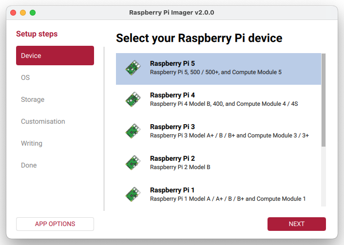</div>

2. Choose an Operating System. Scroll down and select `Media Player OS`.

<div style="margin-bottom:1em">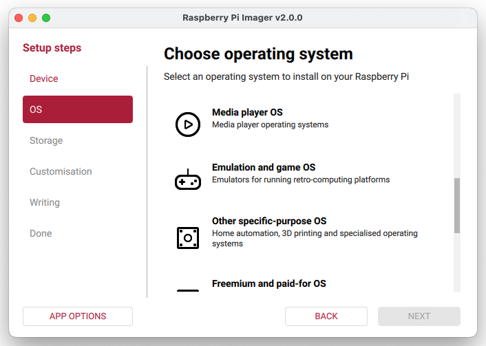</div>

3. Select moOde audio player.

<div style="margin-bottom:1em">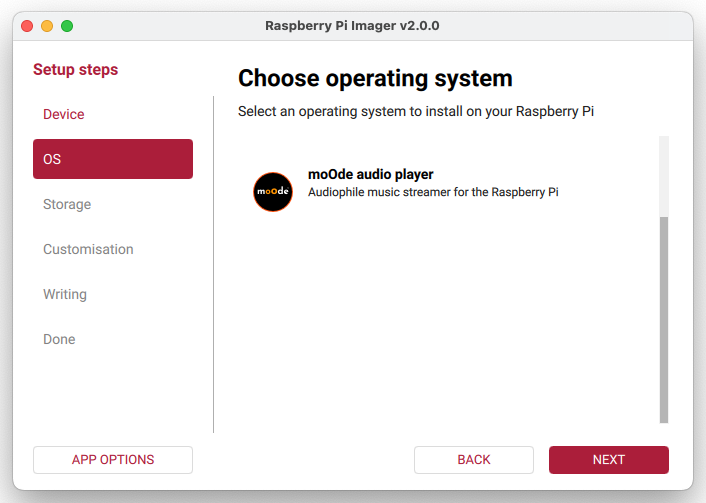</div>

4. Select the specific moOde audio player release.

<div style="margin-bottom:1em">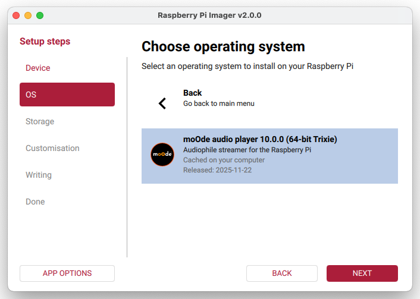</div>

5. Select the storage device for writing the image.

<div style="margin-bottom:1em">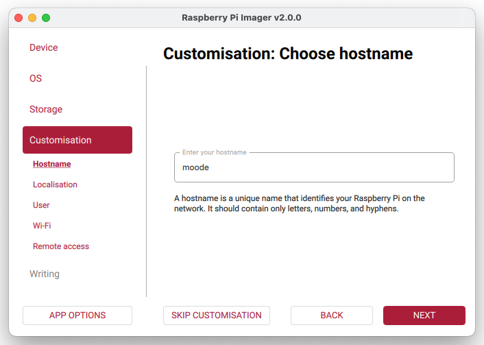</div>

6. Customize the image.

<div style="margin-bottom:1em">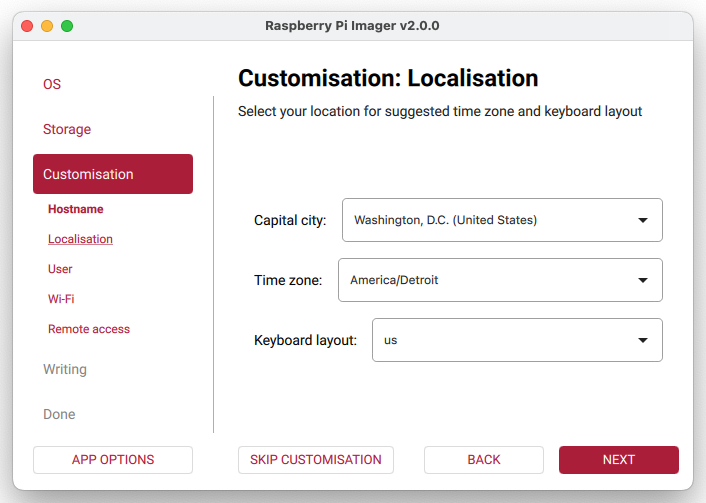</div>
<div style="margin-bottom:1em"></div>
<div style="margin-bottom:1em">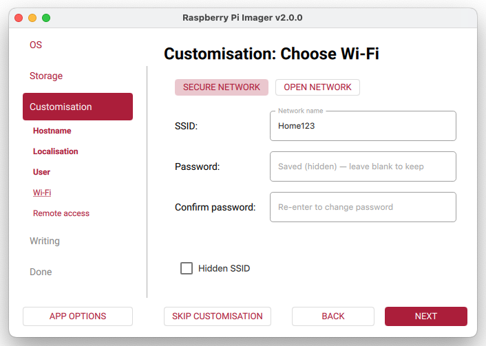</div>
<div style="margin-bottom:1em">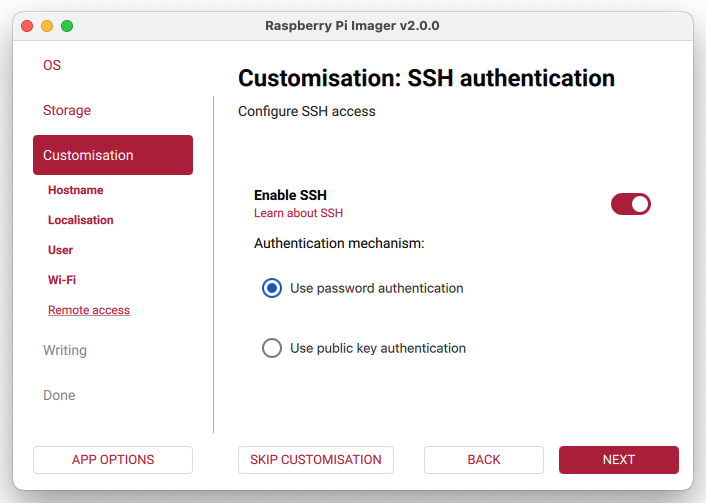</div>
<div style="margin-bottom:1em">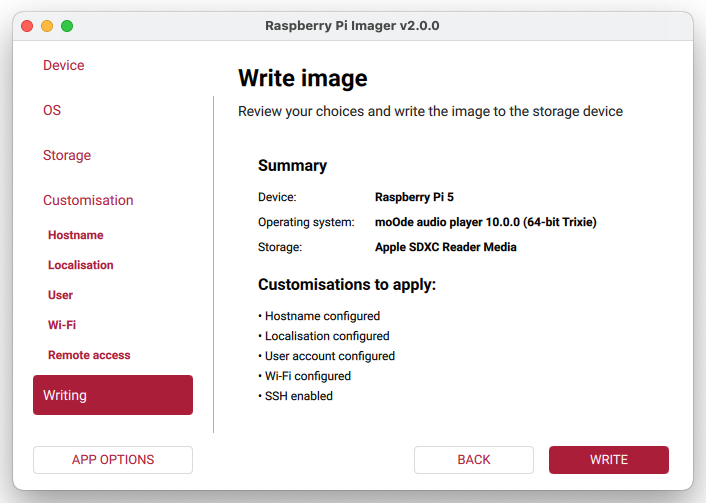</div>

7. Write the image to the storage device.

<div style="margin-bottom:1em"></div>
<div style="margin-bottom:1em">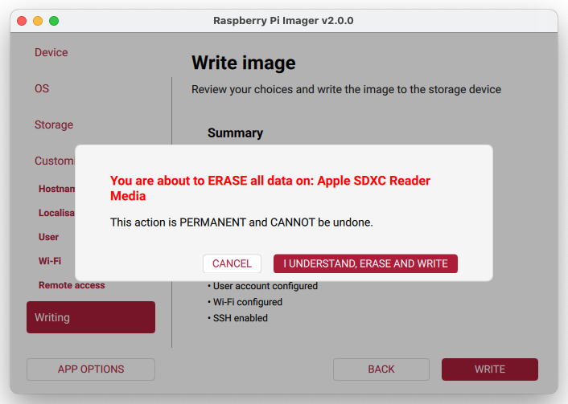</div>
<div style="margin-bottom:1em">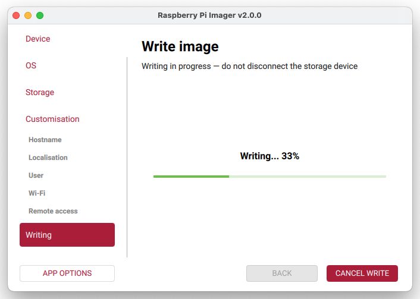</div>
<div style="margin-bottom:1em">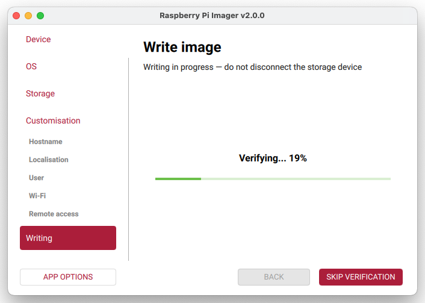</div>

8. After verification is complete the boot media can be removed from the drive and inserted into a Raspberry Pi for initial startup.

<div style="margin-bottom:1em">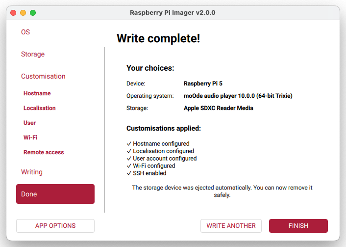</div>

[Back to Top](#setup-guide-)

# 6. Advanced

## 6.1. REST API

### Syntax
`http://moode/command/?cmd=REST_API_COMMAND`

`curl -G -S -s --data-urlencode "cmd=REST_API_COMMAND" http://moode/command/`

### Return format
`If a command returns data it is in JSON format following REST guidelines.`

### Commands

#### get_currentsong
Gets the contents of the file /var/local/www/currentsong.txt.
Turn on the `Metadata file` in the MPD options section in Audio Config to generate this file.  
Arguments: None  
Returns: Contents of metadata file
```
{"file":"NAS\/TRX-FLAC\/Yes\/The Yes Album\/06 Perpetual Change.flac","artist":"Yes","album":"The Yes Album","title":"Perpetual Change","coverurl":"\/coverart.php\/NAS%2FTRX-FLAC%2FYes%2FThe%20Yes%20Album%2F06%20Perpetual%20Change.flac","track":"6","date":"197100","composer":"Anderson\/Squire","encoded":"FLAC 16\/44.1 kHz, 2ch","bitrate":"717 kbps","outrate":"PCM 16\/44.1 kHz, 2ch","volume":"15","mute":"1","state":"play"}
```
#### get_output_format
Gets the ALSA output format or indicates Not playing.  
Arguments: None  
Returns: Output format or "Not playing"

```
{"format":"PCM 16\/44.1 kHz, 2ch"}
{"format":"Not playing"}
```
#### get_volume
Gets the current Knob volume and mute state.  
Arguments: None  
Returns: Volume and mute state.
```
{"volume":"10","muted":"yes"}
```
#### set_volume
Sets the knob volume to value N, up or down N or mute toggle.  
Arguments: `N | -up N | -dn N | -mute`  
Returns: Volume and mute state
```
{"volume":"15","muted":"no"}
```

#### clear_queue
Clears the Queue  
Arguments: None  
Returns: "OK"
```
{"info":"OK"}
```

#### play_item | play_item_next
Plays the specified item.  
 - If the item is an Radio station or Track and its already in the Queue its played otherwise its added/played.
 - If the item is an Album or Playlist the Queue is cleared before adding/playing the item.  

Arguments: URL | URI relative to MPD music or playlists root  
Returns: "OK"

Examples:
```
# Radio station
play_item RADIO/Soma FM - Fluid.pls
play_item http://mediaserv38.live-streams.nl:8006/live

# Playlist
play_item Default Playlist

# Album
play_item NAS/TRX-FLAC/Yes/The Yes Album

# Track
play_item NAS/TRX-FLAC/Yes/The Yes Album/03 Starship Trooper.flac
```
```
{"info":"OK"}
```
#### toggle_play_pause
Toggles between play/stop for Radio stations and play/pause for song files.  
Arguments: None  
Returns: Play state after toggling
```
{"state":"pause"}
```
#### get_cdsp_config
Gets the current CamillaDSP signal processing config name.  
Arguments: None  
Returns: "Config name or off
```
{"config":"off"}
```
#### set_cdsp_config
Sets CamillaDSP to the specified config name.  
Arguments: A config name from the list of available configs including "Off'.  
Returns: Config name or off
```
{"config":"V2-ProtoDAC.yml"}
```
#### get_receiver_status
Get multiroom receiver status
Arguments: None  
Returns: Receiver status
```
{"status":"rx,-Off,15,0,1,sig,239.0.0.1"}

Status fields
rx, On/Off/Disabled/Unknown, volume, volume_mute_1/0, mastervol_opt_in_1/0, hostname, multicast_addr
```
#### set_receiver_onoff
Set multiroom receiver On/Off
Arguments: -on | -off
Returns: Receiver status
```
{"status":"rx,-Off,15,0,1,sig,239.0.0.1"}

Status fields
rx, On/Off/Disabled/Unknown, volume, volume_mute_1/0, mastervol_opt_in_1/0, hostname, multicast_addr
```
#### set_coverview
Sets CoverView screen saver on or off.  
Arguments: `-on | -off`  
Returns: On/off state
```
{"info":"CoverView off"}`
```
#### upd_library
Submits an "Update library" command.  
Arguments: None  
Returns: Info confirmation
```
{"info":"Library update submitted"}
```

#### restart_renderer
Restarts the specified renderer.  
Arguments: `--bluetooth | --airplay | --spotify | --deezer | --squeezelite | --plexamp | --roonbridge`  
Returns: Info confirmation
```
{"info":"Renderer restart submitted"}
```

#### renderer_onoff
Turns the specified renderer on or off  
Arguments: `--bluetooth | --airplay | --spotify | --deezer | --squeezelite | --plexamp | --roonbridge [on|off]`  
Returns: Info confirmation
```
{"info":"Renderer --airplay on submitted"}
```

#### set_display
Sets locally attached display to WebUI or Peppy or Toggles between them
Arguments: `webui | peppy | toggle`  
Returns: Info confirmation
```
{"info":"Set display to peppy submitted"}
```
#### MPD commands
See [MPD protocol](https://mpd.readthedocs.io/en/latest/protocol.html) for list of commands and returns.

## 6.2. SSH Commands

There are several useful commands that can be run at the prompt in an SSH terminal.

#### moodeutl
This command can be used for printing logs, status or for manipulating various parts of Moode.  
`moodeutl --help`.

#### mpc
This command can be used to control MPD.  
`mpc help`.

#### vol.sh
This command can be used to get or set MPD volume and update the Volume Knob.  
`/var/www/util/vol.sh --help`.

#### libupd-submit.php
This command performs the equivalent of Menu > Update library. Run using sudo.
`sudo /var/www/util/libupd-submit.php`

#### coverview.php
This command turns the CoverView screen saver on or off.  
`/var/www/util/coverview.php -on | -off`

#### restart-renderer.php
This command restarts the specified renderer.  
`/var/www/util/restart-renderer.php --help`  

[Back to Top](#setup-guide-)
